# LocalLLM

**The truly offline-first LLM manager for mobile. Your AI, your device, your data.**

<p align="center">
  
  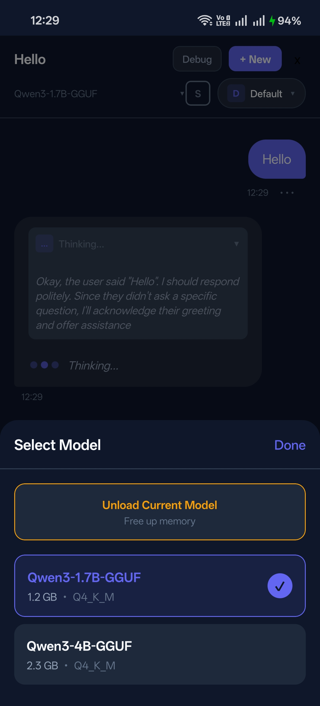
  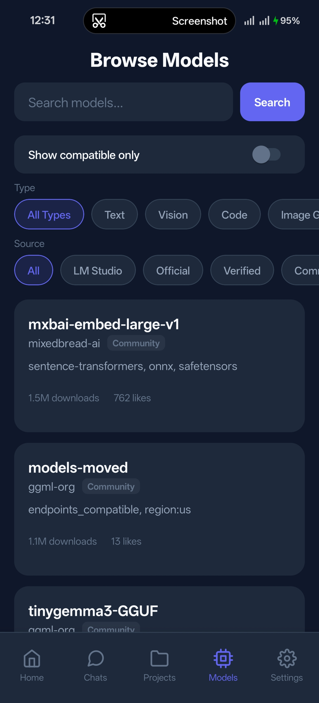
</p>

LocalLLM is a React Native application that brings the power of large language models directly to your mobile device. Unlike cloud-based AI assistants that send every conversation to remote servers, LocalLLM runs **entirely on-device**—no internet required, no data leaves your phone, complete privacy guaranteed.

---

## Why LocalLLM?

In a world where AI assistants harvest your conversations, LocalLLM takes a different approach:

| Cloud AI | LocalLLM |
|----------|----------|
| Requires internet | Works completely offline |
| Data sent to servers | Data never leaves device |
| Monthly subscriptions | One-time model download |
| Privacy policies change | You control everything |
| Service can shut down | Your AI is always available |

**This is AI the way it should be—truly yours.**

---

## Visual Tour

### Home Dashboard

The home screen gives you a complete overview at a glance: your currently active model, all downloaded models ready to use, and quick actions to start chatting or explore more models.

<p align="center">
  
  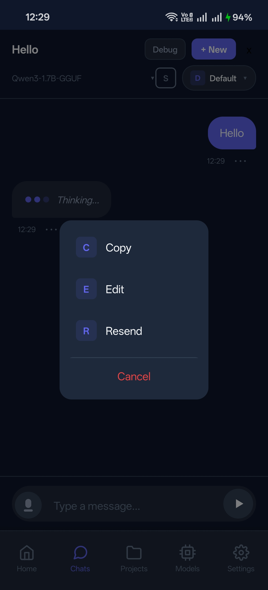
</p>

### Intelligent Chat Interface

A full-featured chat experience with real-time streaming responses. Watch the AI think before it responds with the expandable thought process view—perfect for reasoning models like Qwen3.

<p align="center">
  
  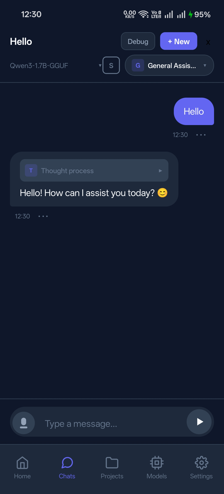
</p>

**Chat features include:**
- Real-time token streaming
- Expandable thought process view (for reasoning models)
- Message actions: Copy, Edit, Resend
- Voice input with on-device Whisper transcription
- Debug panel for power users

### Switch Models Instantly

Tap the model name in the header to switch between downloaded models without leaving your conversation. Load, unload, or switch with a single tap.

<p align="center">
  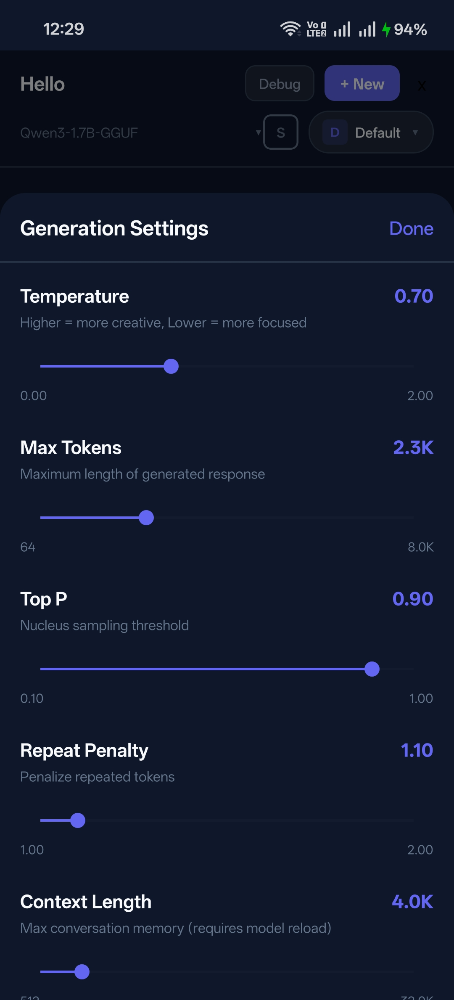
</p>

### Fine-Tune Every Parameter

Full control over inference parameters, just like LM Studio on desktop. Adjust temperature, tokens, sampling, and performance settings to get exactly the responses you want.

<p align="center">
  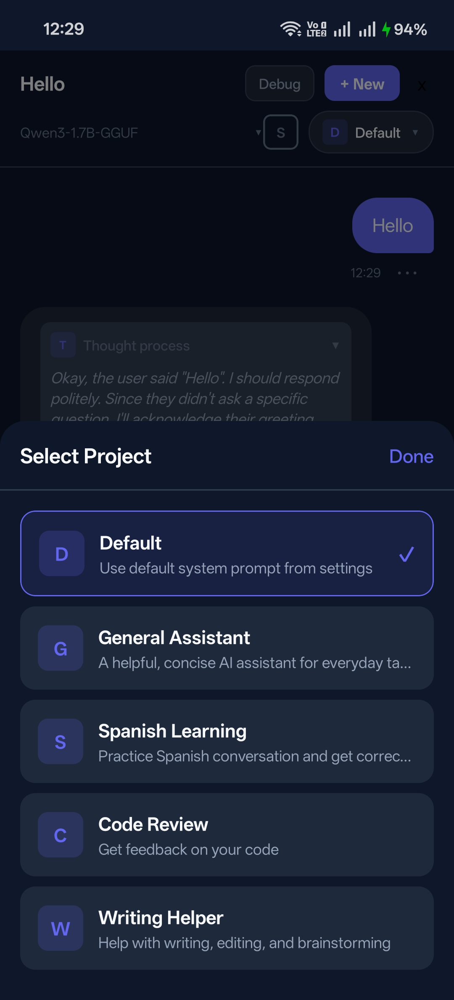
</p>

| Setting | Range | Description |
|---------|-------|-------------|
| Temperature | 0 - 2 | Controls creativity/randomness |
| Max Tokens | 64 - 4096 | Response length limit |
| Top P | 0.1 - 1.0 | Nucleus sampling threshold |
| Repeat Penalty | 1.0 - 2.0 | Reduces repetition |
| Context Length | 512 - 8192 | Conversation memory window |
| CPU Threads | 1 - 12 | Performance tuning |
| Batch Size | 32 - 512 | Processing chunk size |

### Projects (AI Personas)

Create custom AI personalities with unique system prompts. Perfect for different use cases—code review, creative writing, language learning, or anything you imagine.

<p align="center">
  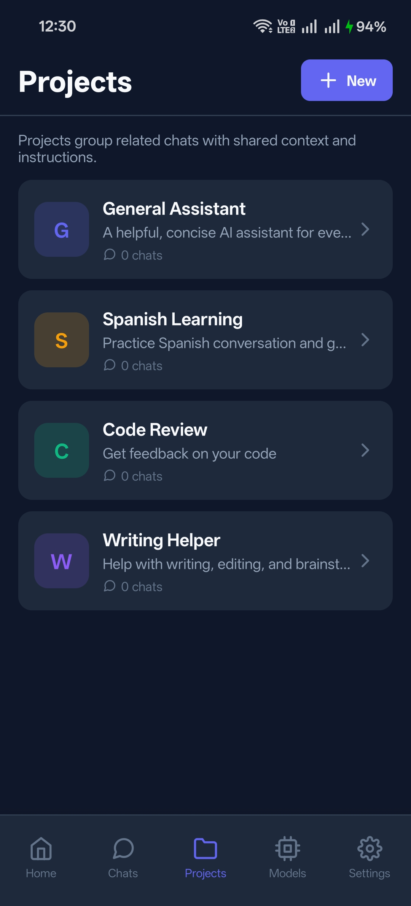
  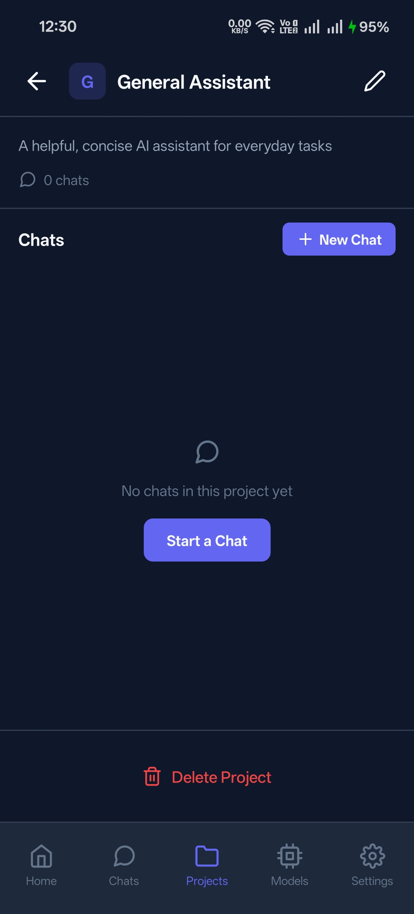
  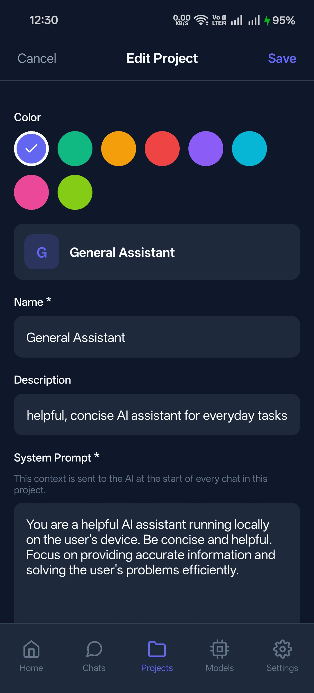
</p>

Each project has its own:
- Color-coded identity
- Custom system prompt
- Dedicated conversation history
- Quick-switch from chat header

<p align="center">
  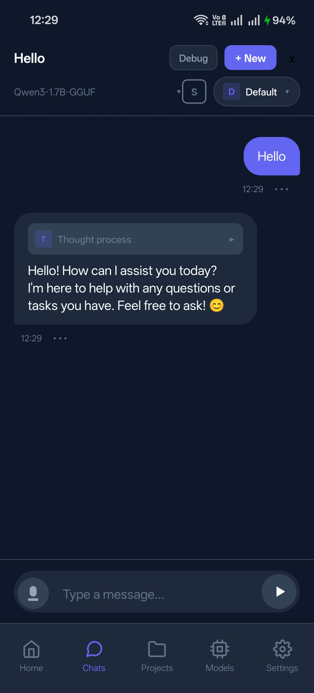
  
</p>

### Conversation Management

All your chats organized with project badges, timestamps, and previews. Quickly find any conversation or start fresh.

<p align="center">
  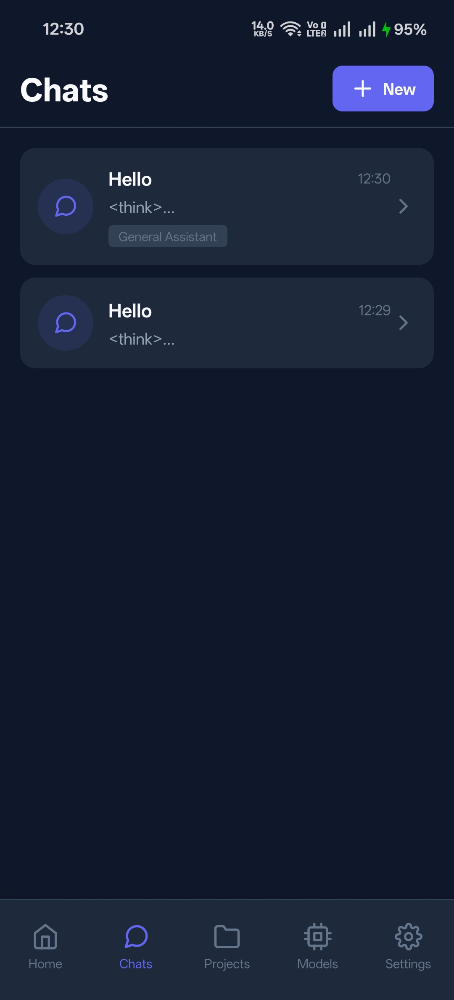
</p>

### Browse & Download Models

Search Hugging Face's vast model library directly from the app. Filter by type (Text, Vision, Code) and source (LM Studio, Official, Verified, Community). Compatibility is checked automatically before download.

<p align="center">
  
</p>

### On-Device Voice Transcription

Speak instead of type with Whisper-powered voice input. Like the LLM itself, transcription runs **entirely on-device**—your voice never leaves your phone.

<p align="center">
  
</p>

**Voice features:**
- Hold to record, release to transcribe
- Slide left to cancel
- Real-time partial transcription
- Multiple Whisper model sizes

### Debug & Developer Tools

For power users, a comprehensive debug panel shows exactly what's happening: context statistics, message counts, the active project's system prompt, and the exact ChatML-formatted prompt sent to the model.

<p align="center">
  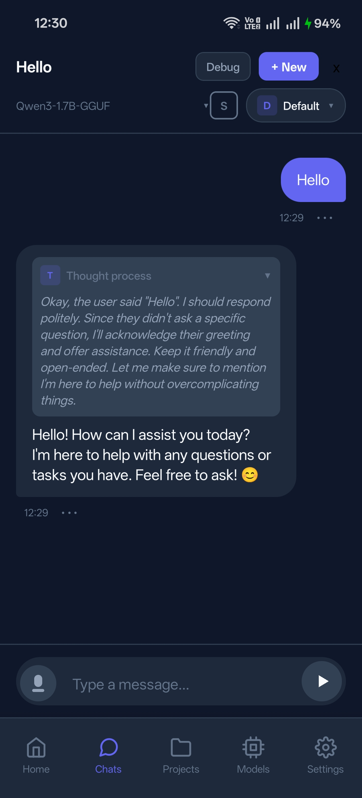
  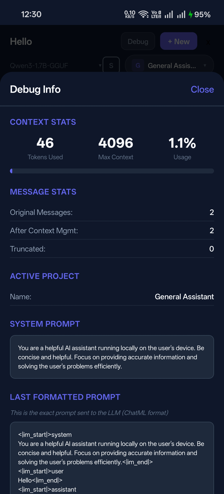
  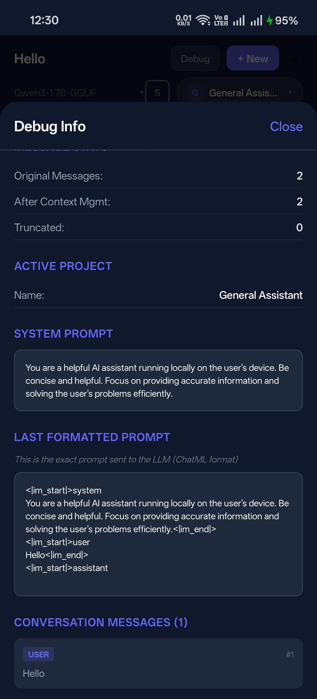
</p>

### Security & Settings

Optional passphrase lock protects your conversations. Device information helps you understand what hardware is running your AI.

<p align="center">
  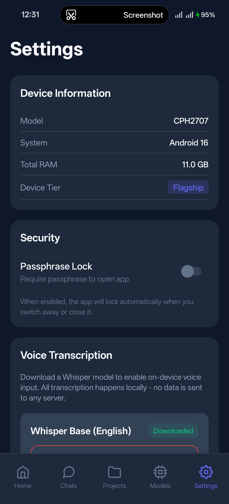
</p>

---

## Quick Start

### Option 1: Install Pre-built APK

1. Download the latest APK from [Releases](https://github.com/alichherawalla/offline-mobile-llm-manager/releases)
2. Transfer to your Android device
3. Enable "Install from Unknown Sources" in Settings
4. Install and launch LocalLLM
5. Download a model and start chatting!

### Option 2: Build from Source

```bash
# Clone the repository
git clone https://github.com/alichherawalla/offline-mobile-llm-manager.git
cd LocalLLM

# Install dependencies
npm install

# Run on connected Android device
npm run android
```

---

## How It Works

LocalLLM uses [llama.cpp](https://github.com/ggerganov/llama.cpp) compiled for Android to run GGUF-quantized language models directly on your device's CPU. The app intelligently detects your device's capabilities and recommends appropriate models.

### Architecture

```
┌─────────────────────────────────────────────────────┐
│                   React Native UI                    │
├─────────────────────────────────────────────────────┤
│              TypeScript Services Layer               │
│   ┌─────────────┐ ┌─────────────┐ ┌─────────────┐  │
│   │  LLM Service│ │Whisper Svc  │ │Hardware Svc │  │
│   └─────────────┘ └─────────────┘ └─────────────┘  │
├─────────────────────────────────────────────────────┤
│              Native Module Bridge                    │
├─────────────────────────────────────────────────────┤
│    llama.rn + whisper.rn (C++ via JNI/Android NDK) │
└─────────────────────────────────────────────────────┘
```

---

## Privacy & Security

**Your data stays on your device. Period.**

- All model inference runs locally using llama.cpp
- All voice transcription runs locally using whisper.cpp
- Conversations are stored only in local app storage
- No analytics, tracking, or telemetry
- No network requests except for model downloads
- Optional passphrase lock for sensitive conversations

### Network Activity

The **only** network activity is:
1. Fetching model metadata from Hugging Face
2. Downloading model files (GGUF)

After downloading models, the app works **completely offline**. Enable airplane mode and chat indefinitely.

---

## Device Compatibility

### Hardware Requirements

| Device Tier | RAM | Recommended Models | Performance |
|-------------|-----|-------------------|-------------|
| **Flagship** | ≥8 GB | 7B Q4_K_M, 7B Q5_K_M | Excellent |
| **High** | 6-8 GB | 3B Q4_K_M, 7B Q2_K | Good |
| **Medium** | 4-6 GB | 1B-3B models, Q3_K | Moderate |
| **Entry** | <4 GB | TinyLlama, SmolLM | Basic |

### Tested Devices

- Google Pixel 6/7/8 series
- Samsung Galaxy S21/S22/S23/S24 series
- OnePlus 9/10/11/12 series
- Xiaomi 12/13/14 series
- Most devices with 6GB+ RAM and ARM64 processor

### Minimum Requirements

- Android 7.0 (API 24) or later
- ARM64 processor
- 4GB RAM (for smallest models)
- 2GB free storage (varies by model)

---

## Quantization Guide

GGUF models come in different quantization levels. Choose the right balance of quality and performance for your device.

| Quantization | Quality | Size (7B) | RAM Needed | Best For |
|--------------|---------|-----------|------------|----------|
| **Q2_K** | Lowest | ~2.5 GB | ~3.5 GB | Very limited RAM |
| **Q3_K_M** | Low-Med | ~3.3 GB | ~4.5 GB | Budget devices |
| **Q4_K_M** | Good | ~4.0 GB | ~5.5 GB | **Most devices** |
| **Q5_K_M** | Very Good | ~5.0 GB | ~6.5 GB | Quality focus |
| **Q6_K** | Excellent | ~6.0 GB | ~7.5 GB | Flagship devices |
| **Q8_0** | Near FP16 | ~7.5 GB | ~9.0 GB | Maximum quality |

**Recommendation:** Start with **Q4_K_M** for the best balance of quality and performance.

---

## Supported Models

LocalLLM supports any GGUF-format model compatible with llama.cpp:

- **Qwen3** - Excellent multilingual reasoning
- **Llama 3.2** - Meta's latest open models
- **Phi-3** - Microsoft's efficient small models
- **Gemma 2** - Google's open models
- **Mistral** - High-quality European models
- **SmolLM** - Hugging Face's tiny but capable models
- And thousands more on Hugging Face

---

## Project Structure

```
LocalLLM/
├── src/
│   ├── components/      # Reusable UI components
│   ├── constants/       # App-wide constants and theme
│   ├── hooks/           # Custom React hooks
│   ├── navigation/      # React Navigation setup
│   ├── screens/         # Main app screens
│   ├── services/        # LLM, Whisper, hardware services
│   ├── stores/          # Zustand state management
│   └── types/           # TypeScript definitions
├── android/             # Android native code
└── screenshots/         # App screenshots
```

---

## Building for Production

### Debug APK

```bash
cd android && ./gradlew assembleDebug
# Output: android/app/build/outputs/apk/debug/app-debug.apk
```

### Release APK

```bash
cd android && ./gradlew assembleRelease
# Output: android/app/build/outputs/apk/release/app-release.apk
```

See the [full build guide](#building-from-source) below for signing configuration.

---

## Technical Stack

- **React Native** with TypeScript
- **llama.rn** - Native GGUF model inference via llama.cpp
- **whisper.rn** - On-device speech recognition via whisper.cpp
- **Zustand** - State management with AsyncStorage persistence
- **React Navigation** - Native navigation with nested stacks

---

## Contributing

Contributions are welcome! Please read our contributing guidelines before submitting PRs.

## License

MIT License - See LICENSE file for details.

## Acknowledgments

- [llama.cpp](https://github.com/ggerganov/llama.cpp) - The inference engine
- [whisper.cpp](https://github.com/ggerganov/whisper.cpp) - Speech recognition engine
- [llama.rn](https://github.com/mybigday/llama.rn) - React Native LLM bindings
- [whisper.rn](https://github.com/mybigday/whisper.rn) - React Native Whisper bindings
- [Hugging Face](https://huggingface.co) - Model hosting and discovery

---

<p align="center">
  <strong>LocalLLM</strong> — Because your AI should be truly yours.
  <br>
  <em>Built with privacy in mind, powered by open-source AI.</em>
</p>
