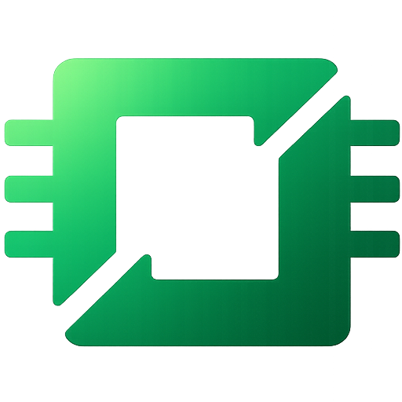

<div align="center">



# Off Grid

**Truly offline-first LLM manager for mobile. Your AI, your device, your data.**

  https://github.com/user-attachments/assets/c3218c22-6714-4f2b-9c55-4dc1fd8dfe25

**Watch the full demo above to see Off Grid in action**

</div>

---

OffgridMobile is a React Native application that brings large language models, vision AI, and image generation directly to **Android and iOS** devices. All inference runs entirely on-device using llama.cpp, whisper.cpp, local-dream (Android), and Apple's Core ML (iOS)—no internet required after initial model download, no data transmission, complete privacy guaranteed.

### Platform Support

| Feature | Android | iOS |
|---------|---------|-----|
| Text Generation (GGUF) | llama.cpp (CPU + OpenCL GPU) | llama.cpp (CPU + Metal) |
| Vision AI | llama.rn multimodal | llama.rn multimodal |
| Image Generation | local-dream (MNN/QNN) | Core ML (ANE + CPU) |
| Voice Transcription | whisper.cpp | whisper.cpp |
| PDF Extraction | PdfRenderer (Kotlin) | PDFKit (Swift) |
| Document Viewer | Intent.ACTION_VIEW | QuickLook |
| Background Downloads | Native DownloadManager | RNFS / URLSession |

---

## Key Features at a Glance

- **Text Generation** - Multi-model GGUF support, streaming inference, custom system prompts
- **Vision AI** - Multimodal understanding with automatic mmproj handling
- **Image Generation** - On-device Stable Diffusion (CPU/NPU), real-time preview, background generation
- **AI Prompt Enhancement** - Use text LLM to expand simple prompts into detailed descriptions for better image quality
- **Voice Transcription** - On-device Whisper for speech-to-text, multiple model sizes
- **Document Attachments** - Attach text files, code, CSV, JSON, and PDFs to chat messages
- **PDF Extraction** - Native on-device PDF text extraction (Android + iOS)
- **Message Queue** - Send multiple messages during active generation, auto-processed sequentially
- **GPU Acceleration** - Optional OpenCL GPU offloading for text models
- **Auto/Manual Image Generation** - Automatic intent detection or manual toggle for image generation
- **Dark Mode** - Full light/dark theme with dynamic color palettes and elevation system
- **Animations** - Staggered entrance animations, spring-based press feedback, haptic responses
- **Passphrase Lock** - Secure sensitive conversations with passphrase protection
- **Advanced Model Settings** - Global configuration for text and image models
- **Performance Tuning** - Configurable threads, batch size, context length, GPU layers
- **Overload Prevention** - Pre-load memory checks prevent OOM crashes
- **Storage Management** - Orphaned file detection, stale download cleanup

---

## Core Capabilities

### Text Generation

Multi-model LLM inference using llama.cpp compiled for ARM64 Android via llama.rn native bindings. Supports any GGUF-format model compatible with llama.cpp:

- **Streaming inference** with real-time token callbacks
- **OpenCL GPU offloading** on Qualcomm Adreno GPUs (experimental, optional)
- **Context window management** with automatic truncation and continuation
- **Performance instrumentation** - Tracks tok/s (overall and decode-only), TTFT, token count
- **Custom system prompts** via project-based conversation contexts
- **KV cache management** with manual clear capability for memory optimization

**Implementation:**
- `llmService` (`src/services/llm.ts`) wraps llama.rn for model lifecycle and inference
- `generationService` (`src/services/generationService.ts`) provides background-safe orchestration
- `activeModelService` (`src/services/activeModelService.ts`) singleton ensures safe model loading/unloading
- State managed via Zustand stores (`src/stores/`) with AsyncStorage persistence

**GPU Acceleration:**
llama.cpp's OpenCL backend enables GPU offloading on Qualcomm Adreno GPUs. Configurable layer count (0-99) determines CPU/GPU split. Automatic fallback to CPU-only if OpenCL initialization fails. CPU inference uses ARM NEON, i8mm, and dotprod SIMD instructions.

### Vision AI

Multimodal understanding via vision-language models (VLMs) with automatic mmproj (multimodal projector) handling:

- **Automatic mmproj detection** - Vision models automatically download required mmproj companion files
- **Combined asset tracking** - Model size estimates include mmproj overhead
- **Runtime mmproj discovery** - If mmproj wasn't linked during download, searches model directory on load
- **Camera and photo library integration** - React Native Image Picker for image capture/selection
- **OpenAI-compatible message format** - Uses llama.rn's OAI message structure for vision inference

**Implementation:**
- mmproj files loaded via `llmService.initMultimodal()`
- Image URIs converted to `file://` paths and passed in OAI message format
- Vision models tracked separately with `isVisionModel` flag and combined size calculation
- SmolVLM 500M-2.2B recommended (fast, 7-10s inference); Qwen models support multilingual vision

**Supported Vision Models:**
- SmolVLM (500M, 2.2B) - Fast, compact, 7-10s inference on flagship devices
- Qwen2-VL, Qwen3-VL - Excellent multilingual vision understanding
- LLaVA - Large Language and Vision Assistant
- MiniCPM-V - Efficient multimodal

### Image Generation

On-device Stable Diffusion with platform-native acceleration:

**Android:**
- **MNN backend** - Alibaba's MNN framework, works on all ARM64 devices (CPU-only)
- **QNN backend** - Qualcomm AI Engine (NPU acceleration) for Snapdragon 8 Gen 1+
- **Automatic backend detection** - Runtime NPU detection with MNN fallback
- Models from xororz's HuggingFace repos (pre-converted MNN/QNN formats)

**iOS:**
- **Core ML backend** - Apple's ml-stable-diffusion pipeline with Neural Engine (ANE) acceleration
- **DPM-Solver scheduler** - Faster convergence, better quality at fewer steps
- **Safety checker disabled** - Reduced latency (no NSFW classification overhead)
- **Palettized models** - 6-bit quantized (~1GB) for memory-constrained devices
- **Full precision models** - fp16 (~4GB) for maximum speed on ANE
- Models from Apple's official HuggingFace repos (compiled Core ML format)

**Common:**
- **Real-time preview** - Progressive image display every N steps
- **Background generation** - Lifecycle-independent service continues when screens unmount
- **AI prompt enhancement** - Optional LLM-based prompt expansion using loaded text model

**Technical Pipeline:**
```
Text Prompt → CLIP Tokenizer → Text Encoder (embeddings)
  → Scheduler (DPM-Solver/Euler) ↔ UNet (denoising, iterative)
  → VAE Decoder → 512×512 Image
```

**Implementation:**
- `localDreamGeneratorService` (`src/services/localDreamGenerator.ts`) bridges to native via `Platform.select()`
- `imageGenerationService` (`src/services/imageGenerationService.ts`) provides orchestration
- Android: `LocalDreamModule` wraps local-dream C++ lib (MNN/QNN)
- iOS: `CoreMLDiffusionModule` wraps Apple's `StableDiffusionPipeline` (ANE/CPU)
- Progress callbacks, preview callbacks, and completion callbacks flow through singleton service
- Gallery persistence via AsyncStorage with automatic cleanup on conversation deletion

**Prompt Enhancement:**
When enabled, uses the currently loaded text model to expand simple prompts into detailed descriptions:

```typescript
// User input: "Draw a dog"
// LLM enhancement system prompt guides model to add:
// - Artistic style descriptors
// - Lighting and composition details
// - Quality modifiers
// - Concrete visual details

// Result: ~75-word enhanced prompt
// "A golden retriever with soft, fluffy fur, sitting gracefully..."
```

Implementation uses separate message array with enhancement-specific system prompt, calls `llmService.generateResponse()`, then explicitly resets LLM state (`stopGeneration()` only, no KV cache clear to preserve vision inference performance).

**Image Models (Android):**
- CPU (MNN): 5 models (~1.2GB each) - Anything V5, Absolute Reality, QteaMix, ChilloutMix, CuteYukiMix
- NPU (QNN): 20 models (~1.0GB each) - all CPU models plus DreamShaper, Realistic Vision, MajicmixRealistic, etc.
- QNN variants: `min` (non-flagship), `8gen1`, `8gen2` (8 Gen 2/3/4/5)

**Image Models (iOS - Core ML):**
- SD 1.5 Palettized (~1GB) - 6-bit quantized, 512×512
- SD 2.1 Palettized (~1GB) - 6-bit quantized, 512×512
- SDXL iOS (~2GB) - 4-bit mixed-bit palettized, 768×768, ANE-optimized
- SD 1.5 Full (~4GB) - fp16, 512×512, fastest on ANE
- SD 2.1 Base Full (~4GB) - fp16, 512×512, fastest on ANE

**Generation Performance:**
- Android CPU (MNN): ~15s for 512×512 @ 20 steps (Snapdragon 8 Gen 3)
- Android NPU (QNN): ~5-10s for 512×512 @ 20 steps (chipset-dependent)
- iOS ANE (Core ML): ~8-15s for 512×512 @ 20 steps (A17 Pro/M-series), palettized models ~2x slower due to dequantization

### Voice Transcription

On-device speech recognition using whisper.cpp via whisper.rn native bindings:

- **Multiple Whisper models** - Tiny, Base, Small (speed vs accuracy tradeoff)
- **Real-time partial transcription** - Streaming word-by-word results
- **Hold-to-record interface** - Slide-to-cancel gesture support
- **No network** - All transcription happens on-device
- **Auto-download** - Whisper models downloaded on first use
- **Language support** - Multilingual transcription

**Implementation:**
- whisper.rn native module handles audio recording and inference
- Transcription results passed via callbacks to React Native
- Audio temporarily buffered in native code, cleared after transcription
- Model selection in settings (Tiny: fastest, Base: balanced, Small: most accurate)

### Document Attachments

Attach documents to chat messages for context-aware conversations. Documents are parsed and included in the LLM context window alongside the user's message.

**Supported Formats:**
- **Text files** - `.txt`, `.md`, `.log`
- **Code files** - `.py`, `.js`, `.ts`, `.jsx`, `.tsx`, `.java`, `.c`, `.cpp`, `.h`, `.swift`, `.kt`, `.go`, `.rs`, `.rb`, `.php`, `.sql`, `.sh`
- **Data files** - `.csv`, `.json`, `.xml`, `.yaml`, `.yml`, `.toml`, `.ini`, `.cfg`, `.conf`, `.html`
- **PDF documents** - Native text extraction via platform-specific modules

**Features:**
- **File picker integration** - Uses `@react-native-documents/picker` for native file selection
- **PDF text extraction** - Native modules extract text from PDFs on both platforms
- **Persistent storage** - Attached files are copied to persistent app storage so they survive temp file cleanup
- **Tappable document badges** - Tap any attached document in chat to open it with the system viewer (QuickLook on iOS, Intent viewer on Android)
- **Paste-as-attachment** - Large pasted text can be attached as a document
- **File size limit** - 5MB maximum, with text content truncated to 50K characters for context window management

**PDF Extraction Implementation:**
- Android: `PdfExtractorModule` (Kotlin) uses Android's native `PdfRenderer` API
- iOS: `PDFExtractorModule` (Swift) uses Apple's `PDFKit` framework
- Both extract page-by-page text content with page separators
- Graceful fallback when PDF extraction is unavailable

**Document Viewer:**
- Uses `@react-native-documents/viewer` for cross-platform document opening
- iOS: Opens in QuickLook preview
- Android: Opens with `Intent.ACTION_VIEW` using the appropriate system app

### Message Queue

Send messages while the LLM is still generating a response. Messages are queued and processed automatically after the current generation completes.

**Features:**
- **Non-blocking input** - Send button stays active during generation, alongside a visible stop button
- **Queue indicator** - Shows count and preview of queued messages in the toolbar
- **Clear queue** - Tap the "x" on the queue indicator to discard all queued messages
- **Aggregated processing** - When generation completes, all queued messages are combined into a single prompt and processed together
- **Image bypass** - Image generation requests skip the queue and process immediately via the separate image generation service
- **Stop + Send side-by-side** - Both stop and send buttons visible in the input area during active generation

**Implementation:**
- Queue lives in `generationService.ts` as transient state (not persisted across app restarts)
- User messages are added to chat only when the queue processor picks them up, preserving correct chronology
- ChatScreen registers a `queueProcessor` callback; when generation resets and the queue has items, the service calls this callback
- Multiple queued messages are aggregated: texts joined with `\n\n`, attachments combined

### Image Generation Modes

**Auto Detection:**
- AI automatically classifies user intent (text response vs image generation)
- Uses pattern matching or LLM-based classification (configurable)
- Pattern mode: Fast keyword matching ("draw", "generate", "create image")
- LLM mode: More accurate, uses loaded text model for classification

**Manual Override:**
- Toggle button forces image generation mode
- Useful when auto-detection misclassifies
- Stays active for current message only

**Settings Configuration:**
```typescript
// Image generation mode setting
imageGenerationMode: 'off' | 'auto' | 'manual'

// Auto-detection method
autoDetectMethod: 'pattern' | 'llm'
```

### Security Features

**Passphrase Lock:**
- Protect conversations with passphrase
- App-level security layer on top of OS encryption
- Locks on app backgrounding (configurable timeout)
- Biometric unlock (planned)

**Implementation:**
- Passphrase stored securely in Android Keystore
- Conversations encrypted with AES-256
- No biometric data stored on device

### Model Settings

**Text Model Settings:**
- Temperature (0-2.0) - Creativity control
- Max tokens (64-4096) - Response length limit
- Top-p (0.1-1.0) - Nucleus sampling threshold
- Repeat penalty (1.0-2.0) - Repetition reduction
- Context length (512-8192) - Conversation memory window
- CPU threads (1-12) - Performance tuning
- Batch size (32-512) - Processing chunk size
- GPU layers (0-99) - GPU offload configuration
- Enable GPU (on/off) - Toggle GPU acceleration

**Image Model Settings:**
- Steps (4-50) - Quality vs speed (default: 20)
- Guidance scale (1-20) - Prompt adherence (default: 7.5)
- Seed (random/fixed) - Reproducibility control
- Resolution (256x256-512x512) - Output size
- Preview interval (1-10) - Real-time preview frequency
- Enhance prompts (on/off) - AI prompt enhancement toggle
- Detection method (pattern/LLM) - Intent classification mode
- Threads (1-8) - CPU thread count for image generation

**Global Configuration:**
All settings are global and apply to every model. Settings persist across app restarts and affect all models uniformly.

### Overload Prevention

**Pre-Load Memory Checks:**
Before loading any model, system calculates:
```typescript
// Text models
requiredRAM = fileSize * 1.5  // KV cache, activations

// Vision models
requiredRAM = (modelFileSize + mmProjSize) * 1.5

// Image models
requiredRAM = fileSize * 1.8  // MNN/QNN runtime overhead
```

**Memory Budget:**
- Uses 60% of device RAM as safe limit
- Warns at 50% (yellow warning UI)
- Blocks at 60%+ (red error, prevents load)

**User-Friendly Messages:**
```
"Cannot load Qwen3-7B-Q4_K_M (~5.5GB required) - would exceed
device safe limit of 4.8GB. Unload current model or choose smaller."
```

**Benefits:**
- Prevents app crashes from OOM
- Guides users toward compatible models
- Shows exact RAM requirements before download

### Performance Settings Deep Dive

**CPU Threads:**
- More threads = faster inference (to a point)
- Optimal: 4-6 threads on most devices
- Flagship: 6-8 threads
- Diminishing returns beyond 8

**Batch Size:**
- Smaller (32-128): Faster first token
- Larger (256-512): Better throughput
- Default 256: Balanced for mobile

**Context Length:**
- Longer context = more memory + slower
- Automatic truncation when exceeded
- Recommendations:
  - 512: Short conversations
  - 2048: Standard (default)
  - 4096-8192: Long conversations (requires 8GB+ RAM)

**GPU Offloading:**
- Specify number of layers to offload (0-99)
- More layers = faster (if stable)
- OpenCL backend experimental (can crash)
- Start with 0, incrementally increase
- Automatic fallback to CPU if fails

---

## Architecture

### System Overview

```
┌──────────────────────────────────────────────────────────────────┐
│                       React Native UI Layer                       │
│            (Brutalist Design System - TypeScript/TSX)            │
├──────────────────────────────────────────────────────────────────┤
│                  TypeScript Services Layer                        │
│                                                                   │
│   Core Services (background-safe singletons):                    │
│   ┌─────────────────┐  ┌─────────────────┐  ┌─────────────────┐│
│   │   llmService    │  │  whisperService │  │ hardware ││
│   │  (llama.rn)     │  │  (whisper.rn)   │  │  (RAM/CPU info) ││
│   └─────────────────┘  └─────────────────┘  └─────────────────┘│
│                                                                   │
│   Orchestration Services (lifecycle-independent):                │
│   ┌───────────────────────┐  ┌───────────────────────┐          │
│   │  generationService    │  │ imageGenerationService│          │
│   │  (text, background)   │  │  (images, background) │          │
│   └───────────────────────┘  └───────────────────────┘          │
│                                                                   │
│   Management Services:                                           │
│   ┌────────────────────┐  ┌────────────────────┐                │
│   │activeModelService  │  │   modelManager     │                │
│   │(singleton, mem mgmt)│  │(download, storage) │                │
│   └────────────────────┘  └────────────────────┘                │
├──────────────────────────────────────────────────────────────────┤
│                 Native Module Bridge (JNI / ObjC)                 │
├──────────────────────────────────────────────────────────────────┤
│   Native Implementations:                                         │
│                                                                   │
│   Cross-platform:                                                 │
│   ┌──────────────┐  ┌──────────────┐                             │
│   │   llama.rn   │  │  whisper.rn  │                             │
│   │ (C++ native) │  │ (C++ native) │                             │
│   └──────────────┘  └──────────────┘                             │
│                                                                   │
│   Android:                           iOS:                         │
│   ┌──────────┐ ┌───────────────┐    ┌──────────────────────┐    │
│   │local-dream│ │DownloadManager│    │CoreMLDiffusionModule │    │
│   │(C++/MNN)  │ │   (Kotlin)    │    │(StableDiffusionPipe) │    │
│   └──────────┘ └───────────────┘    └──────────────────────┘    │
├──────────────────────────────────────────────────────────────────┤
│   Hardware Acceleration:                                          │
│   Android:                           iOS:                         │
│   ┌──────────────────┐              ┌──────────────────┐         │
│   │OpenCL (Adreno GPU)│              │ ANE (Neural Engine)│         │
│   │  Text LLMs only   │              │  Image gen + LLMs │         │
│   ├──────────────────┤              ├──────────────────┤         │
│   │   QNN (NPU)      │              │  Metal (GPU)     │         │
│   │  Image gen only  │              │  LLM inference   │         │
│   └──────────────────┘              └──────────────────┘         │
└──────────────────────────────────────────────────────────────────┘
```

### Key Design Patterns

**1. Singleton Services**

All core services (`llmService`, `activeModelService`, `generationService`, `imageGenerationService`) are singleton instances to prevent:
- Duplicate model loading
- Concurrent inference conflicts
- Memory leaks from orphaned contexts
- State desynchronization

Example from `activeModelService.ts`:
```typescript
class ActiveModelService {
  private loadedTextModelId: string | null = null;
  private textLoadPromise: Promise<void> | null = null;

  async loadTextModel(modelId: string) {
    // Guard against concurrent loads
    if (this.textLoadPromise) {
      await this.textLoadPromise;
      if (this.loadedTextModelId === modelId) return;
    }
    // ... load logic
  }
}
export const activeModelService = new ActiveModelService();
```

**2. Background-Safe Orchestration**

`generationService` and `imageGenerationService` maintain state independently of React component lifecycle:

```typescript
class GenerationService {
  private state: GenerationState = { isGenerating: false, ... };
  private listeners: Set<GenerationListener> = new Set();

  subscribe(listener: GenerationListener): () => void {
    this.listeners.add(listener);
    listener(this.getState()); // Immediate state delivery
    return () => this.listeners.delete(listener);
  }

  private notifyListeners(): void {
    const state = this.getState();
    this.listeners.forEach(listener => listener(state));
  }
}
```

Screens subscribe on mount, get current state immediately, continue receiving updates until unmount. Generation continues regardless of UI state.

**3. Memory-First Loading**

All model loads check available RAM before proceeding:

```typescript
async loadTextModel(modelId: string) {
  const model = store.downloadedModels.find(m => m.id === modelId);

  // Estimate: file size × 1.5 for text (KV cache overhead)
  const estimatedRAM = (model.fileSize / (1024**3)) * 1.5;

  // Check against device RAM budget (60% of total)
  const deviceRAM = await hardware.getDeviceInfo();
  const budget = (deviceRAM.totalMemory / (1024**3)) * 0.6;

  if (estimatedRAM > budget) {
    throw new Error('Insufficient RAM');
  }

  await llmService.loadModel(model.filePath);
}
```

Vision models add mmproj overhead, image models multiply by 1.8× for MNN/QNN runtime.

**4. Combined Asset Tracking**

Vision models track both main GGUF and mmproj as single logical unit:

```typescript
interface DownloadedModel {
  id: string;
  filePath: string;
  fileSize: number;

  // Vision-specific
  mmProjPath?: string;
  mmProjFileSize?: number;
  isVisionModel: boolean;
}

// Total size calculation
const totalSize = model.fileSize + (model.mmProjFileSize || 0);
const totalRAM = totalSize * 1.5; // Both contribute to RAM estimate
```

**5. Aggressive State Cleanup**

After prompt enhancement (which uses `llmService`), explicit cleanup ensures text generation doesn't hang:

```typescript
// After enhancement completes
await llmService.stopGeneration();  // Clear generating flag
// Note: KV cache NOT cleared to preserve vision inference speed
```

Vision inference can be 30-60s slower if KV cache is cleared after every enhancement.

---

## Design System

### Brutalist Design Philosophy

OffgridMobile uses a terminal-inspired brutalist design system with full light/dark theme support. The system emphasizes information density and functional minimalism with a monochromatic palette and emerald accent.

### Theme System

Dynamic light/dark theming via `src/theme/`:

- **`palettes.ts`** — `COLORS_LIGHT`, `COLORS_DARK`, `SHADOWS_LIGHT`, `SHADOWS_DARK`, `createElevation()`
- **`index.ts`** — `useTheme()` hook, `getTheme(mode)`, `Theme` type
- **`useThemedStyles.ts`** — `useThemedStyles(createStyles)` memoized style factory

Theme mode is stored in `appStore.themeMode` (persisted) and toggled via the Settings screen Dark Mode switch.

**Usage pattern (every screen/component):**
```typescript
const { colors } = useTheme();
const styles = useThemedStyles(createStyles);

const createStyles = (colors: ThemeColors, shadows: ThemeShadows) => ({
  container: { backgroundColor: colors.background },
  card: { ...shadows.medium, backgroundColor: colors.surface },
});
```

**Token split:**
- Theme-independent tokens stay in `src/constants/`: `TYPOGRAPHY`, `SPACING`, `FONTS`
- Dynamic tokens come from hooks: `colors.*`, `shadows.*`

### Animations and Interaction

Powered by `react-native-reanimated` with spring-based physics and `react-native-haptic-feedback`:

- **`AnimatedEntry`** — Staggered fade+slide entrance for lists and grids, with configurable delay, respects `useReducedMotion()`
- **`AnimatedListItem`** — Combines staggered entry animation with spring-based press scale feedback
- **`AnimatedPressable`** — Spring scale-down on press with haptic feedback (selection, impact, notification types)
- **`AppSheet`** — Custom swipe-to-dismiss bottom sheet with spring animation, replacing React Native modals
- **`useFocusTrigger`** — Hook that replays stagger animations on every tab focus
- **Tab transitions** — Fade animations and haptic feedback on bottom tab switches
- **Modal screens** — `slide_from_bottom` animation for all modal presentations

### Design Tokens

**Typography (10-level scale, all Menlo monospace):**
```typescript
export const TYPOGRAPHY = {
  display: { fontSize: 22, fontWeight: '200' },
  h1: { fontSize: 24, fontWeight: '300' },      // Hero text only
  h2: { fontSize: 16, fontWeight: '400' },      // Screen titles
  h3: { fontSize: 13, fontWeight: '400' },      // Section headers
  body: { fontSize: 14, fontWeight: '400' },    // Primary content
  bodySmall: { fontSize: 13, fontWeight: '400' }, // Descriptions
  label: { fontSize: 10, fontWeight: '400' },   // Uppercase labels
  labelSmall: { fontSize: 9, fontWeight: '400' },
  meta: { fontSize: 10, fontWeight: '300' },    // Timestamps
  metaSmall: { fontSize: 9, fontWeight: '300' },
};
```

**Spacing (6-step scale):**
```typescript
export const SPACING = { xs: 4, sm: 8, md: 12, lg: 16, xl: 24, xxl: 32 };
```

---

## State Management

### Zustand Stores

Application state managed via Zustand with AsyncStorage persistence:

**appStore** (`src/stores/appStore.ts`):
- Downloaded models (text, image, Whisper)
- Active model IDs
- Settings (temperature, context length, GPU config, image gen params)
- Hardware info (RAM, available memory)
- Gallery (generated images metadata)
- Background generation state (progress, status, preview path)

**chatStore** (`src/stores/chatStore.ts`):
- Conversations and messages
- Streaming state (current streaming message)
- Message operations (add, update, delete, edit)

**projectStore** (`src/stores/projectStore.ts`):
- Projects (custom system prompts)
- Active project selection

**authStore** (`src/stores/authStore.ts`):
- Passphrase lock state
- Authentication status

**whisperStore** (`src/stores/whisperStore.ts`):
- Whisper model state and selection
- Transcription configuration

**Persistence:**
```typescript
const useAppStore = create<AppStore>()(
  persist(
    (set, get) => ({
      // state and actions
    }),
    {
      name: 'app-storage',
      storage: createJSONStorage(() => AsyncStorage),
    }
  )
);
```

All stores automatically persist to AsyncStorage on state changes, rehydrate on app launch.

### Service-Store Synchronization

Services update stores for UI reactivity:

```typescript
// imageGenerationService updates appStore during generation
private updateState(partial: Partial<ImageGenerationState>): void {
  this.state = { ...this.state, ...partial };
  this.notifyListeners();

  const appStore = useAppStore.getState();
  if ('isGenerating' in partial) {
    appStore.setIsGeneratingImage(this.state.isGenerating);
  }
  if ('progress' in partial) {
    appStore.setImageGenerationProgress(this.state.progress);
  }
}
```

UI components read from stores, services write to stores. Unidirectional data flow.

---

## Background Operations

### Background Downloads (Android)

Native Android DownloadManager handles model downloads:

**Implementation** (`android/app/src/main/java/com/localllm/download/DownloadManagerModule.kt`):
```kotlin
class DownloadManagerModule(reactContext: ReactApplicationContext) :
    ReactContextBaseJavaModule(reactContext) {

  fun downloadFile(url: String, fileName: String, modelId: String) {
    val request = DownloadManager.Request(Uri.parse(url))
      .setTitle(fileName)
      .setNotificationVisibility(DownloadManager.Request.VISIBILITY_VISIBLE)
      .setDestinationInExternalFilesDir(context, "models", fileName)

    val downloadId = downloadManager.enqueue(request)

    // Poll download progress
    monitorDownload(downloadId, modelId)
  }
}
```

Downloads continue even when app is backgrounded or killed. Native notifications show progress. React Native polls for updates via `BroadcastReceiver`.

**Race Condition Fix (Recent):**
On slow emulators, download completion notification could arrive before React Native received `DownloadComplete` event. Fixed by tracking event delivery separately:

```kotlin
// Track event delivery separately from completion status
private data class DownloadInfo(
  val downloadId: Long,
  val modelId: String,
  var completedEventSent: Boolean = false  // New field
)

// Only send event if not already sent
if (!info.completedEventSent) {
  sendDownloadCompleteEvent(modelId)
  info.completedEventSent = true
}
```

### Background Image Generation

`imageGenerationService` maintains generation state independently of React component lifecycle. Native local-dream inference continues on background threads while JavaScript service layer notifies any mounted subscribers.

**Flow:**
1. User starts generation in ChatScreen
2. ChatScreen subscribes to `imageGenerationService`
3. User navigates to HomeScreen (ChatScreen unmounts)
4. Generation continues, service maintains state
5. HomeScreen mounts, subscribes, immediately receives current state (progress, preview)
6. User navigates back to ChatScreen
7. ChatScreen re-subscribes, receives current state (may be complete)

Subscribers are weakly held, services never leak references.

---

## Model Management

### Model Browsing and Discovery

**Text Models:**
- Hugging Face API integration (`src/services/modelManager.ts`)
- Filters: LM Studio compatible, Official/Verified/Community
- Automatic GGUF quantization detection
- RAM compatibility checks based on device memory

**Image Models:**
- xororz HuggingFace repos (pre-converted MNN/QNN)
- Dynamic model list fetch
- Backend filtering (CPU/NPU)
- Chipset variant selection for QNN models

### Download Management

**Features:**
- Background downloads via native Android DownloadManager
- Automatic retry on network interruption
- Storage space pre-check before download
- Combined progress for vision models (shows total for GGUF + mmproj)
- Parallel downloads supported

**Storage Management:**
- Orphaned file detection (GGUF files not tracked in store)
- Stale download cleanup (invalid entries from interrupted downloads)
- Bulk deletion of orphaned files
- Model size breakdown with mmproj overhead included

### Memory Management

**Dynamic Memory Budget:**
- Uses 60% of device RAM as budget for models
- Warns at 50% usage (yellow warning)
- Blocks at 60%+ usage (red error)
- Text models: file size × 1.5 (KV cache, activations)
- Image models: file size × 1.8 (MNN/QNN runtime, intermediate tensors)
- Vision models: text estimate + mmproj overhead

**Pre-load Checks:**
```typescript
async checkMemoryForModel(modelId: string, modelType: 'text' | 'image') {
  const deviceRAM = await hardware.getDeviceInfo();
  const budget = (deviceRAM.totalMemory / (1024**3)) * 0.60;

  const model = findModel(modelId, modelType);
  const requiredRAM = estimateModelMemory(model, modelType);
  const currentlyLoaded = getCurrentlyLoadedMemory();
  const totalRequired = requiredRAM + currentlyLoaded;

  if (totalRequired > budget) {
    return { canLoad: false, severity: 'critical', message: '...' };
  }
  // ...
}
```

Prevents OOM crashes by blocking loads that would exceed safe RAM limits.

---

## Use Cases

### 1. Offline AI Assistant

**Scenario:** User travels with no internet access, needs AI assistance for writing, research, or problem-solving.

**Implementation:**
- Download Qwen3-2B-Instruct (Q4_K_M, ~2.5GB) once
- Create project with custom system prompt: "You are a helpful writing assistant..."
- Generate responses entirely on-device
- All conversations persist locally

**Performance:** 5-10 tok/s on mid-range devices, 15-30 tok/s on flagships.

### 2. Private Image Generation

**Scenario:** Artist/designer needs AI-generated images but doesn't want prompts or outputs sent to cloud services.

**Implementation:**
- Download Anything V5 (CPU) or DreamShaper (NPU) image model
- Enable prompt enhancement for detailed results from simple inputs
- Generate images with seed control for reproducibility
- Save to device gallery or share directly

**Privacy:** Zero network activity after model download. Prompts never leave device.

### 3. Document Analysis with Vision

**Scenario:** User needs to analyze receipts, invoices, or documents on the go without internet.

**Implementation:**
- Download SmolVLM-500M (vision model, ~600MB)
- Capture document photo via camera
- Send to model with prompt: "Extract all line items and totals"
- Receive structured text response

**Performance:** ~7s inference on flagship devices.

### 4. Code Review and Debugging

**Scenario:** Developer needs code assistance without sharing proprietary code with cloud services.

**Implementation:**
- Download Qwen3-Coder or Phi-3-Mini (Q4_K_M)
- Create "Code Review" project with system prompt
- Paste code snippets, receive suggestions
- All code stays on device

**Use case:** Security-sensitive environments, air-gapped development, competitive advantage protection.

### 5. Language Learning Practice

**Scenario:** Language learner practices conversations without subscription or data harvesting.

**Implementation:**
- Download multilingual model (Qwen3, Command-R)
- Create project: "You are a patient Spanish tutor..."
- Voice input via Whisper for pronunciation practice
- Text responses for grammar explanation

**Advantages:** Unlimited practice, no usage limits, complete privacy.

---

## Known Issues and Limitations

### Vision Models

**Performance Considerations:**
- Vision inference can take 10-30+ seconds depending on model size and device
- Larger models (2B+) are slower but provide better understanding
- SmolVLM models offer fastest inference (7-15s on flagship devices)
- Comprehensive logging tracks vision inference progress for debugging

### GPU Acceleration

**OpenCL Stability:**
- OpenCL backend can crash on some Qualcomm devices
- Crash typically happens during layer offload initialization
- Automatic fallback to CPU if GPU initialization fails
- User can manually reduce GPU layers or disable entirely

**Recommendation:** Start with 0 GPU layers, incrementally increase while monitoring stability.

---

## Technical Stack

### Core Dependencies

- **React Native 0.83** - Cross-platform mobile framework
- **TypeScript 5.x** - Type safety and developer experience
- **llama.rn** - Native bindings for llama.cpp GGUF inference
- **whisper.rn** - Native bindings for whisper.cpp speech recognition
- **local-dream** - MNN/QNN Stable Diffusion implementation (Android)
- **ml-stable-diffusion** - Apple's Core ML Stable Diffusion pipeline (iOS)
- **Zustand 5.x** - Lightweight state management
- **AsyncStorage** - Persistent local storage
- **React Navigation 7.x** - Native navigation
- **React Native Reanimated 4.x** - Performant native-thread animations
- **React Native Haptic Feedback** - Haptic responses on interactions
- **@react-native-documents/picker** - Native document picker for file attachments
- **@react-native-documents/viewer** - Native document viewer (QuickLook / Intent.ACTION_VIEW)

### Native Modules

**llama.rn (Android + iOS):**
- Compiles llama.cpp for ARM64
- Android: JNI bindings, OpenCL GPU offloading on Adreno GPUs
- iOS: Metal GPU acceleration
- Handles multimodal (vision) via mmproj

**whisper.rn (Android + iOS):**
- Compiles whisper.cpp for ARM64
- Real-time audio recording and transcription
- Multiple model sizes (Tiny, Base, Small, Medium)

**local-dream (Android only):**
- C++ implementation of Stable Diffusion
- MNN backend (CPU, all ARM64 devices)
- QNN backend (NPU, Snapdragon 8 Gen 1+)
- Automatic backend detection and fallback

**CoreMLDiffusionModule (iOS only):**
- Swift bridge to Apple's `ml-stable-diffusion` StableDiffusionPipeline
- Neural Engine (ANE) acceleration via `.cpuAndNeuralEngine` compute units
- DPM-Solver multistep scheduler for faster convergence
- Safety checker disabled for reduced latency
- Supports palettized (6-bit) and full-precision (fp16) Core ML models

**PdfExtractorModule (Android + iOS):**
- Android: Kotlin module using `android.graphics.pdf.PdfRenderer` for page-by-page text extraction
- iOS: Swift module using Apple's `PDFKit` (`PDFDocument`, `PDFPage`) for text extraction
- Both expose `extractText(filePath)` returning concatenated page text with separators
- Graceful error handling when PDF is corrupted or password-protected

**DownloadManager (Android only):**
- Native Android DownloadManager wrapper
- Background download support
- Progress polling and event emission to React Native
- Proper cleanup and error handling

---

## Getting Started

### Install Pre-built APK

The fastest way to get started:

1. **Download** the latest APK from [GitHub Releases](https://github.com/alichherawalla/offgrid-mobile/releases/latest)
2. **Transfer** to your Android device
3. **Enable** "Install from Unknown Sources" in Android Settings → Security
4. **Install** and launch OffgridMobile
5. **Download a model** from the Models tab and start chatting

### Build from Source

For developers who want to build from source or contribute:

---

## Building from Source

### Prerequisites

- Node.js 20+
- React Native CLI

**Android:**
- JDK 17
- Android SDK (API 34)
- Android NDK r26

**iOS:**
- Xcode 15+ with iOS 17 SDK
- CocoaPods
- Apple Developer account (for device deployment)

### Setup

```bash
# Clone repository
git clone https://github.com/alichherawalla/offgrid-mobile.git
cd OffgridMobile

# Install JavaScript dependencies
npm install

# Android setup
cd android && ./gradlew clean && cd ..

# iOS setup
cd ios && pod install && cd ..
```

### Development Build

```bash
# Start Metro bundler
npm start

# Android (separate terminal)
npm run android

# iOS (separate terminal)
npm run ios

# Or use Xcode
# Open ios/OffgridMobile.xcworkspace
# Select target device → Build & Run
```

### Release Build

```bash
# Android
cd android
./gradlew assembleRelease
# Output: android/app/build/outputs/apk/release/app-release.apk

# iOS
# Open Xcode → Product → Archive → Distribute
```

### Signing Configuration

Create `android/gradle.properties`:
```properties
MYAPP_RELEASE_STORE_FILE=your-release-key.keystore
MYAPP_RELEASE_KEY_ALIAS=your-key-alias
MYAPP_RELEASE_STORE_PASSWORD=***
MYAPP_RELEASE_KEY_PASSWORD=***
```

Add to `android/app/build.gradle`:
```gradle
android {
    signingConfigs {
        release {
            storeFile file(MYAPP_RELEASE_STORE_FILE)
            storePassword MYAPP_RELEASE_STORE_PASSWORD
            keyAlias MYAPP_RELEASE_KEY_ALIAS
            keyPassword MYAPP_RELEASE_KEY_PASSWORD
        }
    }
    buildTypes {
        release {
            signingConfig signingConfigs.release
            // ...
        }
    }
}
```

---

## Project Structure

```
OffgridMobile/
├── src/
│   ├── components/          # Reusable UI components
│   │   ├── AnimatedEntry.tsx       # Staggered fade+slide entrance animation
│   │   ├── AnimatedListItem.tsx    # Entry animation + press feedback combo
│   │   ├── AnimatedPressable.tsx   # Spring scale + haptic press wrapper
│   │   ├── AppSheet.tsx            # Custom swipe-to-dismiss bottom sheet
│   │   ├── ChatInput.tsx           # Message input with attachments
│   │   ├── ChatMessage.tsx         # Message bubbles with metadata
│   │   ├── DebugSheet.tsx          # Developer debug bottom sheet
│   │   ├── ModelCard.tsx           # Model display card
│   │   ├── ModelSelectorModal.tsx  # Quick model switcher
│   │   ├── GenerationSettingsModal.tsx # Image generation settings
│   │   ├── ProjectSelectorSheet.tsx # Project picker bottom sheet
│   │   ├── CustomAlert.tsx         # Consistent alert dialogs
│   │   ├── Button.tsx              # Reusable button component
│   │   ├── Card.tsx                # Reusable card component
│   │   ├── ThinkingIndicator.tsx   # LLM thinking animation
│   │   └── VoiceRecordButton.tsx   # Voice recording button
│   ├── constants/           # Design tokens and configuration
│   │   └── index.ts               # TYPOGRAPHY, SPACING, FONTS
│   ├── hooks/               # Custom React hooks
│   │   ├── useAppState.ts         # App lifecycle state
│   │   ├── useFocusTrigger.ts     # Focus-based animation replay trigger
│   │   ├── useVoiceRecording.ts   # Voice recording logic
│   │   └── useWhisperTranscription.ts # Whisper transcription
│   ├── navigation/          # React Navigation setup
│   │   └── AppNavigator.tsx       # Tab and stack navigators
│   ├── screens/             # Main app screens
│   │   ├── HomeScreen.tsx         # Dashboard with model status
│   │   ├── ChatScreen.tsx         # Main chat interface
│   │   ├── ChatsListScreen.tsx    # Conversation list
│   │   ├── ModelsScreen.tsx       # Browse and download models
│   │   ├── ModelDownloadScreen.tsx # Model download details
│   │   ├── ModelSettingsScreen.tsx # Text and image model settings
│   │   ├── GalleryScreen.tsx      # Generated images gallery
│   │   ├── DownloadManagerScreen.tsx # Download tracking
│   │   ├── StorageSettingsScreen.tsx # Storage management
│   │   ├── SettingsScreen.tsx     # App settings hub
│   │   ├── ProjectsScreen.tsx     # Project list
│   │   ├── ProjectDetailScreen.tsx # Project detail view
│   │   ├── ProjectEditScreen.tsx  # Create/edit projects
│   │   ├── SecuritySettingsScreen.tsx # Security settings
│   │   ├── PassphraseSetupScreen.tsx # Passphrase configuration
│   │   ├── LockScreen.tsx         # App lock screen
│   │   ├── OnboardingScreen.tsx   # First-launch onboarding
│   │   ├── DeviceInfoScreen.tsx   # Device hardware info
│   │   └── VoiceSettingsScreen.tsx # Whisper settings
│   ├── services/            # Core business logic
│   │   ├── llm.ts                 # Text LLM inference
│   │   ├── activeModelService.ts  # Model lifecycle management
│   │   ├── modelManager.ts        # Download and storage
│   │   ├── generationService.ts   # Text generation orchestration
│   │   ├── imageGenerationService.ts # Image generation orchestration
│   │   ├── localDreamGenerator.ts # local-dream bridge
│   │   ├── imageGenerator.ts      # Image generation utilities
│   │   ├── hardware.ts            # Device info and memory
│   │   ├── documentService.ts     # Document attachment processing
│   │   ├── pdfExtractor.ts       # Native PDF text extraction bridge
│   │   ├── authService.ts         # Passphrase authentication
│   │   ├── voiceService.ts        # Voice recording
│   │   ├── whisperService.ts      # Whisper transcription
│   │   ├── intentClassifier.ts    # Image generation intent detection
│   │   ├── huggingFaceModelBrowser.ts # HF model browsing
│   │   ├── huggingface.ts         # HF API utilities
│   │   ├── coreMLModelBrowser.ts  # iOS Core ML model browsing
│   │   ├── backgroundDownloadService.ts # Background download management
│   │   └── index.ts               # Service exports
│   ├── stores/              # Zustand state management
│   │   ├── appStore.ts            # Global app state
│   │   ├── chatStore.ts           # Conversations and messages
│   │   ├── authStore.ts           # Authentication state
│   │   ├── projectStore.ts        # Projects state
│   │   ├── whisperStore.ts        # Whisper model state
│   │   └── index.ts               # Store exports
│   ├── theme/               # Dynamic light/dark theme system
│   │   ├── index.ts               # useTheme() hook, getTheme(), exports
│   │   ├── palettes.ts            # Light/dark color palettes, shadows, elevation
│   │   └── useThemedStyles.ts     # Memoized themed stylesheet factory
│   ├── utils/               # Utility functions
│   │   └── haptics.ts             # Haptic feedback triggers
│   └── types/               # TypeScript type definitions
│       ├── index.ts               # All interfaces and types
│       └── whisper.rn.d.ts        # Whisper native module types
├── android/                 # Android native code
│   └── app/src/main/java/com/localllm/
│       ├── MainActivity.kt        # Main activity
│       ├── MainApplication.kt     # Application entry point
│       ├── download/              # Background download manager
│       │   ├── DownloadManagerModule.kt
│       │   ├── DownloadManagerPackage.kt
│       │   └── DownloadCompleteBroadcastReceiver.kt
│       ├── localdream/            # local-dream native module
│       │   ├── LocalDreamModule.kt
│       │   └── LocalDreamPackage.kt
│       └── pdf/                   # PDF text extraction
│           ├── PdfExtractorModule.kt
│           └── PdfExtractorPackage.kt
├── ios/                     # iOS native code
│   └── OffgridMobile/
│       ├── AppDelegate.swift      # Application delegate
│       ├── CoreMLDiffusion/       # Core ML image generation
│       │   ├── CoreMLDiffusionModule.swift
│       │   └── CoreMLDiffusionModule.m
│       ├── PDFExtractor/          # PDF text extraction
│       │   └── PDFExtractorModule.swift
│       └── Download/              # iOS download manager
│           ├── DownloadManagerModule.swift
│           └── DownloadManagerModule.m
├── docs/                    # Documentation
│   ├── CODEBASE_GUIDE.md         # Comprehensive architecture guide
│   ├── DESIGN_PHILOSOPHY_SYSTEM.md # Design system reference
│   ├── UI_UX_ELEVATION_PLAN.md   # UI/UX elevation plan
│   ├── VISUAL_HIERARCHY_STANDARD.md # Visual hierarchy guidelines
│   ├── IOS_PARITY_PLAN.md        # iOS feature parity plan
│   ├── TEST_FLOWS.md             # End-to-end test flows
│   ├── TEST_COVERAGE_REPORT.md   # Test coverage report
│   ├── TEST_PRIORITY_MAP.md      # Test priority mapping
│   └── TEST_SPEC_FORMAT.md       # Test specification format
└── .claude/                 # Claude Code configuration
    ├── memory/                    # Auto memory files
    └── skills/                    # Custom skills/guidelines
```

---

## Quantization Reference

GGUF quantization methods and their trade-offs:

| Quantization | Bits | Quality | 7B Size | RAM | Use Case |
|--------------|------|---------|---------|-----|----------|
| Q2_K | 2-3 bit | Lowest | ~2.5 GB | ~3.5 GB | Very constrained devices |
| Q3_K_M | 3-4 bit | Low-Med | ~3.3 GB | ~4.5 GB | Budget devices, testing |
| Q4_K_M | 4-5 bit | Good | ~4.0 GB | ~5.5 GB | Recommended default |
| Q5_K_M | 5-6 bit | Very Good | ~5.0 GB | ~6.5 GB | Quality-focused users |
| Q6_K | 6 bit | Excellent | ~6.0 GB | ~7.5 GB | Flagship devices |
| Q8_0 | 8 bit | Near FP16 | ~7.5 GB | ~9.0 GB | Maximum quality |

**Recommendation:** Q4_K_M provides best balance. Q5_K_M for quality on devices with 8GB+ RAM.

---

## Performance Characteristics

### Text Generation

**Flagship devices (Snapdragon 8 Gen 2+):**
- CPU: 15-30 tok/s (4-8 threads)
- GPU (OpenCL): 20-40 tok/s (experimental, stability varies)
- TTFT: 0.5-2s depending on context length

**Mid-range devices (Snapdragon 7 series):**
- CPU: 5-15 tok/s
- TTFT: 1-3s

**Factors:**
- Model size (larger = slower)
- Quantization (lower bits = faster)
- Context length (more tokens = slower)
- Thread count (4-8 threads optimal)
- GPU layers (more = faster if stable)

### Vision Inference

**SmolVLM 500M:**
- Flagship: ~7s per image
- Mid-range: ~15s per image

**SmolVLM 2.2B:**
- Flagship: ~10-15s per image
- Mid-range: ~25-35s per image

**Factors:**
- Image resolution (higher = slower)
- Model size (larger = slower)
- KV cache state (warm cache = faster)

### Image Generation

**CPU (MNN):**
- 512×512, 20 steps: ~15s (Snapdragon 8 Gen 3)
- 512×512, 20 steps: ~30s (Snapdragon 7 series)

**NPU (QNN):**
- 512×512, 20 steps: ~5-10s (chipset-dependent)
- Requires Snapdragon 8 Gen 1+ with QNN support

**Factors:**
- Step count (more steps = better quality, slower)
- Resolution (higher = exponentially slower)
- Backend (NPU > CPU)

---

## Security and Privacy

### Data Storage

- **Conversations:** AsyncStorage (encrypted at OS level)
- **Models:** Internal app files directory
- **Images:** Internal app files directory + optional export to Pictures
- **Settings:** AsyncStorage

All data stored in app's private storage, inaccessible to other apps (Android sandboxing).

### Network Activity

**Model download only:**
- Hugging Face API (model metadata)
- Hugging Face CDN (model file downloads)
- xororz HuggingFace repos (image model listings)

**After model download:**
- Zero network activity
- Enable airplane mode and use indefinitely
- All inference happens on-device

### Optional Security Features

- **Passphrase lock** for sensitive conversations
- **Biometric authentication** (planned)
- **Conversation export/import** with encryption (planned)

---

## Contributing

Contributions welcome. Please:

1. Fork repository
2. Create feature branch
3. Follow existing code style (TypeScript, design tokens)
4. Add tests where applicable
5. Update documentation
6. Submit pull request

### Development Guidelines

- Use `useTheme()` and `useThemedStyles()` for all styling — never hardcode colors
- Use `TYPOGRAPHY` and `SPACING` from `src/constants/` for theme-independent tokens
- Follow singleton pattern for services
- Implement background-safe operations for long-running tasks
- Add comprehensive logging for debugging
- Check memory before model operations
- Handle errors gracefully with user-friendly messages

---

## License

MIT License - See LICENSE file for details.

---

## Acknowledgments

- [llama.cpp](https://github.com/ggerganov/llama.cpp) by Georgi Gerganov - LLM inference engine
- [whisper.cpp](https://github.com/ggerganov/whisper.cpp) by Georgi Gerganov - Speech recognition engine
- [local-dream](https://github.com/nicenemo/local-dream) - On-device Stable Diffusion (Android)
- [ml-stable-diffusion](https://github.com/apple/ml-stable-diffusion) by Apple - Core ML Stable Diffusion pipeline (iOS)
- [MNN](https://github.com/alibaba/MNN) by Alibaba - Mobile neural network inference framework
- [llama.rn](https://github.com/mybigday/llama.rn) by mybigday - React Native bindings for llama.cpp
- [whisper.rn](https://github.com/mybigday/whisper.rn) by mybigday - React Native bindings for whisper.cpp
- [Hugging Face](https://huggingface.co) - Model hosting and discovery
- [xororz](https://huggingface.co/xororz) - Pre-converted Stable Diffusion models for MNN and QNN

---

**Off Grid** — Your AI, your device, your data. Built with privacy in mind, powered by open-source AI.
