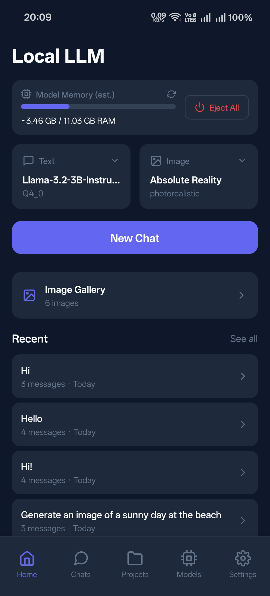
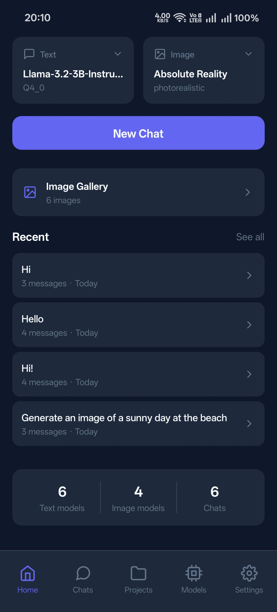
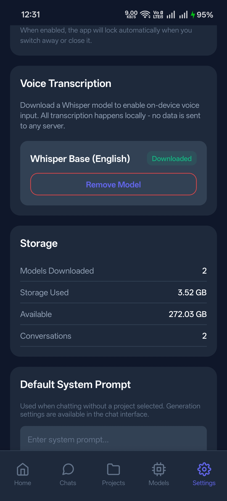

# LocalLLM

**The truly offline-first LLM manager for mobile. Your AI, your device, your data.**

<p align="center">
  
  
  
</p>

LocalLLM is a React Native application that brings the power of large language models and image generation directly to your mobile device. Unlike cloud-based AI assistants that send every conversation to remote servers, LocalLLM runs **entirely on-device**—no internet required, no data leaves your phone, complete privacy guaranteed.

**Now with on-device image generation!** Create stunning AI-generated images from text prompts, completely offline.

---

## Why LocalLLM?

In a world where AI assistants harvest your conversations, LocalLLM takes a different approach:

| Cloud AI | LocalLLM |
|----------|----------|
| Requires internet | Works completely offline |
| Data sent to servers | Data never leaves device |
| Monthly subscriptions | One-time model download |
| Privacy policies change | You control everything |
| Service can shut down | Your AI is always available |

**This is AI the way it should be—truly yours.**

---

## Visual Tour

### Home Dashboard

The home screen gives you a complete overview at a glance: your currently active model, all downloaded models ready to use, and quick actions to start chatting or explore more models.

<p align="center">
  
  
</p>

### Intelligent Chat Interface

A full-featured chat experience with real-time streaming responses. Watch the AI think before it responds with the expandable thought process view—perfect for reasoning models like Qwen3.

<p align="center">
  
  
</p>

Every response shows detailed generation metadata: GPU backend (OpenCL or CPU), model name, decode tok/s, time-to-first-token (TTFT), and total token count.

<p align="center">
  
  
</p>

**Chat features include:**
- Real-time token streaming
- Expandable thought process view (for reasoning models)
- **Generation metadata** — GPU backend, model name, decode tok/s, TTFT, and token count for every response
- Message actions: Copy, Edit, Resend
- Voice input with on-device Whisper transcription
- **Vision model support** with image attachments
- **Document attachments** — Attach PDF, TXT, and other documents (text extracted on-device)
- **System info messages** — Model load times and status shown in chat
- Debug panel for power users

### Vision Model Support

Send images to vision-capable models like LLaVA, SmolVLM, and Qwen-VL. When you download a vision model, LocalLLM automatically detects and downloads the required multimodal projector (mmproj) file alongside the main model.

**Vision features:**
- **Automatic mmproj detection and download** — Combined download progress shows both files
- **Runtime mmproj discovery** — If mmproj wasn't linked during download, it's detected when loading
- **Combined size display** — Model size always includes mmproj for accurate storage estimates
- Camera and photo library support
- Image preview before sending
- Works completely offline after download

**Supported Vision Models:**
- SmolVLM (500M-2B) — Compact and fast
- Qwen2-VL / Qwen3-VL — Excellent multilingual vision
- LLaVA — Large Language and Vision Assistant
- MiniCPM-V — Efficient multimodal

---

## 🎨 On-Device Image Generation

LocalLLM now includes **on-device AI image generation** powered by [local-dream](https://github.com/nicenemo/local-dream) with MNN (CPU) and QNN (NPU) backends. Generate stunning images from text prompts—completely offline, completely private.

### How It Works

```
┌─────────────────────────────────────────────────────────────────┐
│                    Image Generation Pipeline                      │
├─────────────────────────────────────────────────────────────────┤
│                                                                   │
│   "A sunny day at the beach"                                     │
│            │                                                      │
│            ▼                                                      │
│   ┌─────────────────┐                                            │
│   │  CLIP Tokenizer │  Text → Token IDs                          │
│   └────────┬────────┘                                            │
│            │                                                      │
│            ▼                                                      │
│   ┌─────────────────┐                                            │
│   │  Text Encoder   │  Token IDs → Text Embeddings (768-dim)     │
│   └────────┬────────┘                                            │
│            │                                                      │
│            ▼                                                      │
│   ┌─────────────────┐     ┌─────────────────┐                    │
│   │     Scheduler   │ ──▶ │      UNet       │  Iterative         │
│   │  (Euler)        │ ◀── │  (Denoising)    │  Denoising         │
│   └─────────────────┘     └────────┬────────┘                    │
│                                    │                              │
│                                    ▼                              │
│                           ┌─────────────────┐                    │
│                           │   VAE Decoder   │  Latents → Image   │
│                           └────────┬────────┘                    │
│                                    │                              │
│                                    ▼                              │
│                           ┌─────────────────┐                    │
│                           │  512×512 Image  │                    │
│                           └─────────────────┘                    │
│                                                                   │
└─────────────────────────────────────────────────────────────────┘
```

### Supported Image Models

Models are fetched dynamically from xororz's HuggingFace repos. The in-app model browser lets you search and filter by backend (CPU/NPU).

**CPU models (MNN backend — works on any ARM64 device):** ~5 models including Anything V5, Absolute Reality, QteaMix, ChilloutMix, and CuteYukiMix.

**NPU models (QNN backend — Snapdragon 8 Gen 1+):** ~20 models including all CPU models plus DreamShaper, Realistic Vision, MajicmixRealistic, MistoonAnime, NaiAnime, and many more. NPU models come in three chipset variants:
- `min` — non-flagship Snapdragon chips
- `8gen1` — Snapdragon 8 Gen 1
- `8gen2` — Snapdragon 8 Gen 2/3/4/5

| Backend | Model Size | Steps | Generation Time* |
|---------|-----------|-------|------------------|
| **CPU (MNN)** | ~1.2 GB | 20 | ~15 seconds |
| **NPU (QNN)** | ~1.0 GB | 20 | ~5-10 seconds |

*512×512 resolution, measured on Snapdragon 8 Gen 3. CPU times vary by device; NPU times depend on chipset variant.

### Image Generation in Action

<p align="center">
  
  
  
</p>

<p align="center">
  
</p>

### Image Generation Features

- **Dynamic Model Browser**: Browse all available models from xororz's HuggingFace repos. Search by name, filter by CPU/NPU backend, see real file sizes, and download with one tap.
- **Background Generation**: Image generation continues even when you navigate between screens. Start generating, switch to another chat or the home screen, and come back — your image will have progressed or completed while you were away.
- **Image Gallery**: A dedicated gallery screen shows all your generated images in a grid. Open it from the Home screen or from the image icon in any chat header. When opened from a chat, it filters to show only images from that conversation.
- **Real-time Preview**: See your image emerge during generation (every 2 steps)
- **Automatic Intent Detection**: AI classifies if your message wants an image or text response
- **Manual Override**: Force image generation with the toggle button
- **Fullscreen Viewer**: Tap any generated image to view in fullscreen with details — prompt, steps, resolution, seed, and creation date. Save or delete from the viewer.
- **Save to Gallery**: Save generated images to your Pictures folder
- **Generation Timing**: See how long each image took to generate
- **Customizable Settings**:
  - Steps (4-50)
  - Guidance Scale (1-20)
  - Random or fixed seed

### Using Image Generation

1. **Download an Image Model**
   - Go to Models tab → Image Models section
   - Browse available models, search by name, or filter by CPU/NPU
   - Download any model (CPU models work on all devices, NPU models require Snapdragon 8 Gen 1+)

2. **Set as Active**
   - Tap "Set Active" on your downloaded model
   - The model loads automatically (or on next chat)

3. **Generate Images**
   - Type a descriptive prompt: "A majestic mountain at sunset with golden light"
   - **Auto Mode**: AI detects image requests automatically
   - **Force Mode**: Tap the image icon to force image generation
   - Wait for the magic ✨

4. **Save Your Creation**
   - Tap the generated image to view fullscreen
   - Tap "Save" to save to Pictures/LocalLLM

### Background Image Generation

Unlike most on-device AI apps, LocalLLM doesn't force you to stare at a progress bar. Image generation runs in a **lifecycle-independent background service** — the native inference continues on background threads while the JavaScript service layer maintains state independently of any screen.

**How it works:**

```
Start generation in Chat
        │
        ▼
┌─────────────────────────────┐
│  ImageGenerationService     │  ← Singleton, not tied to any screen
│  (TypeScript service layer) │
│                             │
│  Owns all callbacks         │
│  Tracks progress, preview,  │
│  result, errors             │
│  Notifies subscribers       │
└──────────┬──────────────────┘
           │
           ▼
┌─────────────────────────────┐
│  LocalDreamModule           │  ← Native MNN/QNN inference
│  (runs on background thread)│
│                             │
│  Continues even when JS     │
│  screens unmount             │
└─────────────────────────────┘
```

**What this means for you:**

1. Start image generation in any chat
2. Navigate freely — check settings, browse models, start a text chat
3. Come back to the chat and see real-time progress resumed instantly
4. If the image finished while you were away, it's already saved to the chat and the gallery

The gallery and any active screen subscribe to the service on mount and immediately receive the current state. No progress is lost.

### Image Gallery

All generated images are persisted and accessible from a dedicated Gallery screen:

- **From Home**: Tap the "Image Gallery" card to see all generated images
- **From Chat**: Tap the image icon in the chat header to see images from that conversation
- **Grid View**: All images displayed in a 3-column grid, newest first
- **Fullscreen Viewer**: Tap any image to view fullscreen with:
  - **Info panel**: Prompt, negative prompt, steps, resolution, seed, and date
  - **Save**: Export to Pictures/LocalLLM on device storage
  - **Delete**: Remove the image permanently
- **Active Generation**: If an image is being generated, a progress banner appears at the top of the gallery with preview thumbnail, progress bar, and cancel button
- **Long-press to delete**: Quick delete any image from the grid view
- **Cascade Delete**: When you delete a chat, all images generated in that conversation are automatically deleted as well — no orphaned files left behind

Image metadata is persisted across app restarts via AsyncStorage, so your gallery survives app closures.

### Image Generation Settings

| Setting | Range | Default | Description |
|---------|-------|---------|-------------|
| **Steps** | 4-50 | 20 | More steps = higher quality, slower |
| **Guidance Scale** | 1-20 | 7.5 | Higher = closer to prompt, less creative |
| **Seed** | Any | Random | Same seed = reproducible results |

**Pro Tips:**
- 20 steps at 512×512 generates in ~15 seconds on flagship devices
- Lower guidance for abstract art, higher for specific subjects
- Use detailed prompts: include style, lighting, composition

### Technical Details

**local-dream Inference:**
- **MNN backend (CPU):** Multi-threaded ARM NEON inference, works on any ARM64 device
- **QNN backend (NPU):** Hardware-accelerated inference on Qualcomm Snapdragon 8 Gen 1+ via Qualcomm AI Engine
- **Auto backend selection:** Automatically detects NPU support and uses QNN when available, falls back to MNN
- Models are pre-converted and hosted on HuggingFace by [xororz](https://huggingface.co/xororz)

**Model Architecture:**
- CLIP text encoder for prompt understanding
- UNet for iterative denoising (the heavy lifting)
- VAE decoder for final image generation
- Euler scheduler for diffusion sampling

**Memory Usage:**
- ~1-1.5 GB during generation
- Models unloaded after generation if needed
- Background loading on app startup

### Privacy Note

Just like text generation, **all image generation happens 100% on-device**:
- No images sent to any server
- No prompts logged or transmitted
- Generated images stay in local storage
- Enable airplane mode and create freely

---

### Switch Models Instantly

Tap the model name in the header to switch between downloaded models without leaving your conversation. Separate tabs for Text and Image models let you load, unload, or switch with a single tap.

<p align="center">
  
  
</p>

### Fine-Tune Every Parameter

Full control over inference parameters for both text and image generation. Adjust temperature, tokens, sampling, GPU offloading, and image generation settings to get exactly the results you want.

<p align="center">
  
  
  
</p>

| Setting | Range | Description |
|---------|-------|-------------|
| Temperature | 0 - 2 | Controls creativity/randomness |
| Max Tokens | 64 - 4096 | Response length limit |
| Top P | 0.1 - 1.0 | Nucleus sampling threshold |
| Repeat Penalty | 1.0 - 2.0 | Reduces repetition |
| Context Length | 512 - 8192 | Conversation memory window |
| CPU Threads | 1 - 12 | Performance tuning |
| Batch Size | 32 - 512 | Processing chunk size |
| GPU Layers | 0 - 99 | Layers offloaded to GPU (0 = CPU only) |
| Enable GPU | On/Off | Toggle GPU acceleration |

### Projects

Create custom AI contexts with unique system prompts. Perfect for different use cases—code review, creative writing, language learning, or anything you imagine.

<p align="center">
  
</p>

Each project has its own:
- Color-coded identity
- Custom system prompt
- Dedicated conversation history
- Quick-switch from chat header

### Browse & Download Models

Search Hugging Face's vast model library directly from the app. Filter by type (Text, Vision, Code, Image Generation) and source (LM Studio, Official, Verified, Community). Separate tabs for Text and Image models. Compatibility is checked automatically before download.

<p align="center">
  
  
</p>

### Download Manager

Track active downloads and manage all your downloaded models in one place. See storage usage, delete unused models, and monitor download progress.

<p align="center">
  
  
</p>

**Download features:**
- **Combined progress for vision models** — Shows total progress including mmproj file
- **Background downloads on Android** — Downloads continue even when app is backgrounded
- **Automatic retry** — Handles network interruptions gracefully
- **Storage-aware** — Checks available space before downloading

### Memory Management

LocalLLM intelligently manages device memory to prevent crashes and ensure smooth performance.

**Memory safety features:**
- **Pre-load memory check** — Before loading any model, the app estimates RAM requirements and warns if memory is low
- **Dynamic memory budget** — Uses up to 60% of device RAM for models, adjusts based on your device
- **Combined RAM estimates** — Vision models show total RAM including mmproj overhead
- **Graceful warnings** — Yellow warning for tight memory, red block for insufficient memory
- **Memory display** — Home screen shows estimated RAM usage for loaded models

**RAM estimation:**
- Text models: File size × 1.5 (accounts for KV cache and activations)
- Image models: File size × 1.8 (accounts for ONNX runtime overhead)
- Vision projectors: Added to text model estimate

### Storage Management

Keep your device clean with built-in storage management tools.

**Settings → Storage** provides:
- **Storage overview** — Used vs. available space with visual bar
- **Model breakdown** — Size of each downloaded model (including mmproj)
- **Orphaned file detection** — Finds GGUF files on disk that aren't tracked as models (from failed downloads, manual copies, etc.)
- **Stale download cleanup** — Clears invalid download entries that can appear after interrupted downloads
- **Bulk deletion** — Delete all orphaned files with one tap

### On-Device Voice Transcription

Speak instead of type with Whisper-powered voice input. Like the LLM itself, transcription runs **entirely on-device**—your voice never leaves your phone.

<p align="center">
  
</p>

**Voice features:**
- Hold to record, release to transcribe
- Slide left to cancel
- Real-time partial transcription
- Multiple Whisper model sizes

### Settings & Model Configuration

Configure model behavior, image generation, GPU acceleration, and security from the Settings screen.

<p align="center">
  
  
  
</p>

---

## Quick Start

### Option 1: Install Pre-built APK

1. Download the APK: **[Latest release (APK)](https://github.com/alichherawalla/offline-mobile-llm-manager/releases/latest)** (~166 MB)
2. Transfer to your Android device
3. Enable "Install from Unknown Sources" in Settings
4. Install and launch LocalLLM
5. Download a model and start chatting!

### Option 2: Build from Source

```bash
# Clone the repository
git clone https://github.com/alichherawalla/offline-mobile-llm-manager.git
cd LocalLLM

# Install dependencies
npm install

# Run on connected Android device
npm run android
```

---

## How It Works

LocalLLM uses [llama.cpp](https://github.com/ggerganov/llama.cpp) compiled for Android to run GGUF-quantized language models directly on your device's CPU and GPU. The app intelligently detects your device's capabilities and recommends appropriate models.

### GPU Acceleration

LocalLLM supports GPU offloading for text model inference via the OpenCL backend on Qualcomm Adreno GPUs. Configure the number of GPU layers in Settings > Model Settings — each layer offloaded to the GPU reduces CPU load. If GPU initialization fails, the app automatically falls back to CPU-only inference.

The active backend (OpenCL or CPU) is displayed alongside every generated response, together with decode speed and time-to-first-token.

> **Note:** GPU support via OpenCL is experimental. On some Qualcomm devices the OpenCL compute driver can be unstable for LLM workloads. If you experience crashes, reduce GPU layers or disable GPU entirely — the CPU inference path with ARM NEON/i8mm/dotprod SIMD optimizations delivers strong performance on modern Snapdragon chips.

### Architecture

```
┌──────────────────────────────────────────────────────────────────┐
│                       React Native UI                             │
├──────────────────────────────────────────────────────────────────┤
│                  TypeScript Services Layer                        │
│   ┌─────────────┐ ┌─────────────┐ ┌─────────────┐ ┌───────────┐ │
│   │  LLM Service│ │Whisper Svc  │ │Hardware Svc │ │LocalDream │ │
│   └─────────────┘ └─────────────┘ └─────────────┘ └───────────┘ │
│   ┌──────────────────┐ ┌──────────────────────┐                  │
│   │Generation Service│ │ImageGeneration Svc   │  ← Background   │
│   │  (text, bg)      │ │  (images, bg)        │    singletons   │
│   └──────────────────┘ └──────────────────────┘                  │
├──────────────────────────────────────────────────────────────────┤
│                    Native Module Bridge                           │
├──────────────────────────────────────────────────────────────────┤
│   llama.rn      whisper.rn      local-dream     Android DL Mgr   │
│   (C++ JNI)     (C++ JNI)       (MNN/QNN)       (Kotlin)         │
├──────────────────────────────────────────────────────────────────┤
│   GPU: OpenCL (Adreno)          NPU: QNN (Snapdragon 8 Gen 1+)    │
└──────────────────────────────────────────────────────────────────┘
```

---

## Privacy & Security

**Your data stays on your device. Period.**

- All model inference runs locally using llama.cpp
- All voice transcription runs locally using whisper.cpp
- Conversations are stored only in local app storage
- No analytics, tracking, or telemetry
- No network requests except for model downloads
- Optional passphrase lock for sensitive conversations

### Network Activity

The **only** network activity is:
1. Fetching text model metadata from Hugging Face
2. Fetching image model listings from xororz's HuggingFace repos
3. Downloading model files (GGUF for text, ZIP for image)

After downloading models, the app works **completely offline**. Enable airplane mode and chat indefinitely.

---

## Device Compatibility

### Hardware Requirements

| Device Tier | RAM | Recommended Models | Performance |
|-------------|-----|-------------------|-------------|
| **Flagship** | ≥8 GB | 7B Q4_K_M, 7B Q5_K_M | Excellent |
| **High** | 6-8 GB | 3B Q4_K_M, 7B Q2_K | Good |
| **Medium** | 4-6 GB | 1B-3B models, Q3_K | Moderate |
| **Entry** | <4 GB | TinyLlama, SmolLM | Basic |

### Tested Devices

- Google Pixel 6/7/8 series
- Samsung Galaxy S21/S22/S23/S24 series
- OnePlus 9/10/11/12 series
- Xiaomi 12/13/14 series
- Most devices with 6GB+ RAM and ARM64 processor

### Minimum Requirements

- Android 7.0 (API 24) or later
- ARM64 processor
- 4GB RAM (for smallest models)
- 2GB free storage (varies by model)

---

## Quantization Guide

GGUF models come in different quantization levels. Choose the right balance of quality and performance for your device.

| Quantization | Quality | Size (7B) | RAM Needed | Best For |
|--------------|---------|-----------|------------|----------|
| **Q2_K** | Lowest | ~2.5 GB | ~3.5 GB | Very limited RAM |
| **Q3_K_M** | Low-Med | ~3.3 GB | ~4.5 GB | Budget devices |
| **Q4_K_M** | Good | ~4.0 GB | ~5.5 GB | **Most devices** |
| **Q5_K_M** | Very Good | ~5.0 GB | ~6.5 GB | Quality focus |
| **Q6_K** | Excellent | ~6.0 GB | ~7.5 GB | Flagship devices |
| **Q8_0** | Near FP16 | ~7.5 GB | ~9.0 GB | Maximum quality |

**Recommendation:** Start with **Q4_K_M** for the best balance of quality and performance.

---

## Supported Models

LocalLLM supports any GGUF-format model compatible with llama.cpp:

### Text Models
- **Qwen3** - Excellent multilingual reasoning
- **Llama 3.2** - Meta's latest open models
- **Phi-3** - Microsoft's efficient small models
- **Gemma 2** - Google's open models
- **Mistral** - High-quality European models
- **SmolLM** - Hugging Face's tiny but capable models

### Vision Models
- **SmolVLM** - Compact vision-language model (recommended)
- **LLaVA** - Large Language and Vision Assistant
- **Qwen2-VL** - Qwen's vision-language models
- **MiniCPM-V** - Efficient multimodal models

Vision models automatically download the required mmproj companion file for image understanding.

And thousands more on Hugging Face...

---

## Project Structure

```
LocalLLM/
├── src/
│   ├── components/      # Reusable UI components
│   │   ├── ChatInput.tsx        # Message input with attachments
│   │   ├── ChatMessage.tsx      # Message bubbles with metadata
│   │   ├── ModelCard.tsx        # Model display card
│   │   ├── ModelSelectorModal   # Quick model switcher
│   │   └── CustomAlert.tsx      # Consistent alert dialogs
│   ├── constants/       # App-wide constants and theme
│   ├── hooks/           # Custom React hooks
│   ├── navigation/      # React Navigation setup
│   ├── screens/         # Main app screens
│   │   ├── HomeScreen           # Dashboard with model status
│   │   ├── ChatScreen           # Main chat interface
│   │   ├── ModelsScreen         # Browse and download models
│   │   ├── GalleryScreen        # Generated images gallery
│   │   └── StorageSettingsScreen # Storage and cleanup
│   ├── services/        # Core services
│   │   ├── llm.ts               # LLM inference via llama.rn
│   │   ├── activeModelService   # Singleton model lifecycle manager
│   │   ├── modelManager         # Download and storage management
│   │   ├── generationService    # Text generation orchestration
│   │   ├── imageGenerationService # Image gen orchestration
│   │   ├── hardwareService      # Device info and memory
│   │   ├── documentService      # Document text extraction
│   │   └── localDreamGenerator  # local-dream bridge
│   ├── stores/          # Zustand state management
│   └── types/           # TypeScript definitions
├── android/             # Android native code
│   └── app/src/main/java/com/localllm/
│       ├── download/            # Background download manager
│       └── localdream/          # local-dream native module
└── screenshots/         # App screenshots
```

---

## Building for Production

### Debug APK

```bash
cd android && ./gradlew assembleDebug
# Output: android/app/build/outputs/apk/debug/app-debug.apk
```

### Release APK

```bash
cd android && ./gradlew assembleRelease
# Output: android/app/build/outputs/apk/release/app-release.apk
```

See the [full build guide](#building-from-source) below for signing configuration.

---

## Technical Stack

- **React Native** with TypeScript
- **llama.rn** - Native GGUF model inference via llama.cpp with optional OpenCL GPU offloading
- **whisper.rn** - On-device speech recognition via whisper.cpp
- **local-dream** - Stable Diffusion image generation via MNN (CPU) and QNN (NPU) backends with auto backend selection
- **Android DownloadManager** - Native background model downloads that survive app backgrounding
- **Zustand** - State management with AsyncStorage persistence
- **React Navigation** - Native navigation with nested stacks

### Key Architecture Patterns

- **Singleton Services** — `activeModelService` manages model lifecycle to prevent duplicate loads and memory leaks
- **Memory-First Loading** — All model loads check available RAM before proceeding
- **Combined Asset Tracking** — Vision models track both main GGUF and mmproj as a single unit
- **Background-Safe Operations** — Downloads and image generation continue when screens unmount
- **Orphan Detection** — Storage management finds and cleans up untracked files

---

## Contributing

Contributions are welcome! Please read our contributing guidelines before submitting PRs.

## License

MIT License - See LICENSE file for details.

## Acknowledgments

- [llama.cpp](https://github.com/ggerganov/llama.cpp) - The LLM inference engine
- [whisper.cpp](https://github.com/ggerganov/whisper.cpp) - Speech recognition engine
- [local-dream](https://github.com/nicenemo/local-dream) - On-device Stable Diffusion via MNN/QNN
- [MNN](https://github.com/alibaba/MNN) - Alibaba's lightweight deep learning inference framework
- [llama.rn](https://github.com/mybigday/llama.rn) - React Native LLM bindings
- [whisper.rn](https://github.com/mybigday/whisper.rn) - React Native Whisper bindings
- [Hugging Face](https://huggingface.co) - Model hosting and discovery
- [xororz](https://huggingface.co/xororz) - Pre-converted SD models for MNN and QNN backends

---

<p align="center">
  <strong>LocalLLM</strong> — Because your AI should be truly yours.
  <br>
  <em>Built with privacy in mind, powered by open-source AI.</em>
</p>
